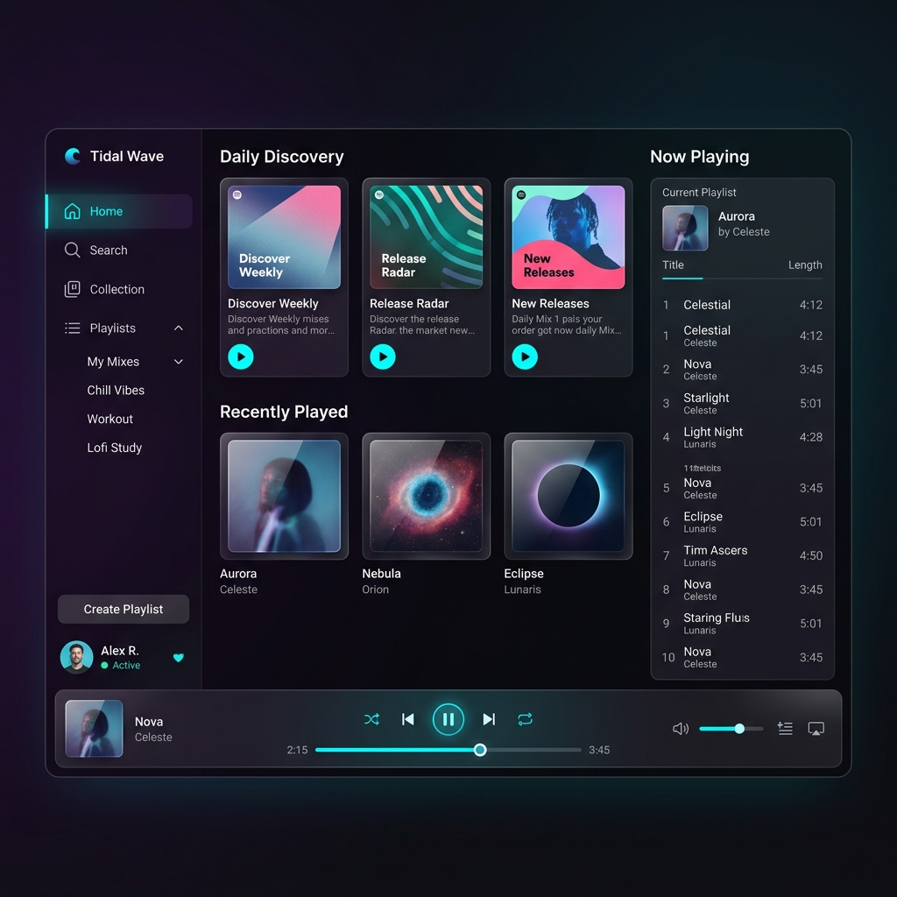

# 🌊 Tidal Wave Desktop Client

[](https://en.cppreference.com/w/cpp/20)
[](https://www.qt.io/)
[](LICENSE)

**Tidal Wave** is a modern, high-performance, and feature-rich desktop client for the **Tidal** music streaming service. Built with C++20, CMake, and Qt 6/QML, it provides a fluid, responsive UI that integrates seamlessly with your system.

---

## 🎨 Visual Interface

Here is a preview of the Tidal Wave desktop interface:



---

## 🚀 Key Features

*   **Fluid & Aesthetic UI**: A gorgeous, modern dark-themed user interface styled with glassmorphism, glowing accents, and smooth transitions built using Qt Quick (QML).
*   **Complete Music Player**: Full playback controls featuring seek bars, precise volume adjustments, and dynamic shuffle/repeat states.
*   **Media Queue Management**: Add tracks, albums, or playlists to the playback queue, view upcoming songs, and reorder playback.
*   **Smart Music Collection**: Browse and play tracks, playlists, albums, and artists saved in your collection, alongside personalized daily mixes.
*   **Linux MPRIS2 Support**: Integrates directly with Linux desktop environments via DBus, enabling support for hardware media keys, locked-screen widgets, and system notification overlays.
*   **Discord Rich Presence (RPC)**: Shares your listening status (current track, artist, album art, elapsed time, and total duration) with your friends on Discord in real-time.
*   **High-Performance C++ Core**: Leveraging C++20 and asynchronous Qt features to ensure a fast, resource-efficient background execution, multi-threaded networking, and robust caching.

---

## 🛠️ Tech Stack & Architecture

*   **Language**: C++20
*   **UI Framework**: Qt 6.4+ (Quick / QML)
*   **Build System**: CMake (minimum 3.20)
*   **System Integrations**: DBus (MPRIS2) on Linux, Discord Game SDK (RPC)

### Directory Structure

*   `src/api/` — Core API classes managing OAuth authentication, token refresh, and interaction with Tidal's endpoints.
*   `src/player/` — Sound engine implementation controlling local playback and queue management.
*   `src/mpris/` — DBus interfaces publishing player state to MPRIS2 daemon.
*   `src/ui/` — Bridge code registering C++ classes to QML context, handling image providers, and running Discord Rich Presence updates.
*   `qml/` — Declarative frontend code defining pages (`HomePage`, `CollectionPage`, `LoginPage`) and UI controls.
*   `assets/` — Icons and UI branding assets.

---

## 📥 Installation & Setup

### Prerequisites

To build Tidal Wave from source, ensure you have the following installed:

*   A C++20 compatible compiler (e.g., GCC 10+, Clang 11+, or MSVC 2019+)
*   **CMake** (version 3.20 or higher)
*   **Qt 6 SDK** (version 6.4 or higher) with the following modules:
    *   `Core`, `Gui`, `Widgets`, `Quick`, `Qml`, `Network`, `DBus`, `Multimedia`, `Sql`, `Svg`, `Concurrent`

#### On Debian/Ubuntu-based systems:
```bash
sudo apt install build-essential cmake qt6-base-dev qt6-declarative-dev qt6-multimedia-dev qt6-svg-dev libqt6svg6-dev libsqlite3-dev
```

### Build Instructions

1.  **Clone the Repository**:
    ```bash
    git clone https://github.com/immineal/tidal-wave.git
    cd tidal-wave
    ```

2.  **Configure the Build**:
    ```bash
    cmake -B build -S . -DCMAKE_BUILD_TYPE=Release
    ```

3.  **Compile the Application**:
    ```bash
    cmake --build build --parallel $(nproc)
    ```

4.  **Run the Executable**:
    ```bash
    ./build/tidal-wave
    ```

---

## 📝 License

This project is licensed under the MIT License. See the [LICENSE](LICENSE) file for details.
