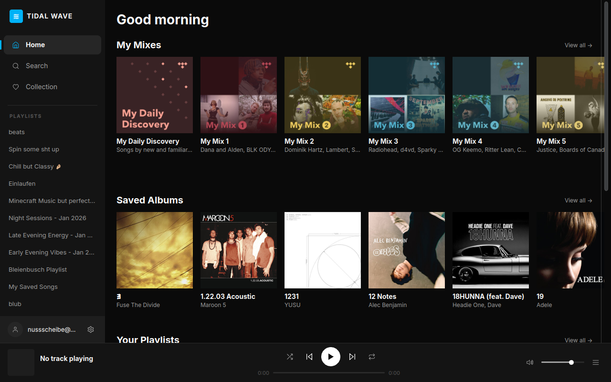

# Tidal Wave Desktop Client

Tidal Wave is a native, lightweight desktop client for the Tidal music streaming service. It is built using C++20, CMake, and Qt 6/QML, delivering a fast, system-integrated music listening experience.

## Interface Screenshot



## Noteworthy Features

*   **Native Performance**: Built with C++20 and Qt 6, bypassing heavy web wrappers for a minimal CPU and memory footprint.
*   **Media Keys and MPRIS2**: Full Linux media player integration via D-Bus MPRIS2, supporting lockscreen controls, system volume widgets, and media keys.
*   **Secure Authentication**: Implements Tidal OAuth device login flow with secure local session caching using SQLite.
*   **Custom Audio Player**: Native streaming audio engine utilizing QMediaPlayer and QAudioOutput with selectable stream qualities.
*   **Persistent Navigation State**: Separate loaders retain individual page states when jumping between Home, Search, and My Collection views.
*   **Queue Panel**: Full queue management including track ordering, shuffle, and cycle repeat modes.
*   **System Tray Integration**: Background playback support with system tray control options to show, hide, and quit the application.
*   **Rich Detail Pages**: Dedicated views for albums, artists, playlists, and mixes. Biographies are parsed as rich text with clickable navigation links.

## Keyboard Shortcuts

| Shortcut | Action |
| --- | --- |
| Space | Play / Pause |
| Ctrl + Right | Next track |
| Ctrl + Left | Previous track |
| Right | Seek forward 10 seconds |
| Left | Seek backward 10 seconds |
| Up | Volume up (5% increment) |
| Down | Volume down (5% increment) |
| Ctrl + M | Mute / Unmute |
| Ctrl + S | Toggle Shuffle |
| Ctrl + R | Cycle Repeat Mode (Off / All / One) |
| Ctrl + 1 | Go to Home |
| Ctrl + 2 | Go to Search |
| Ctrl + 3 | Go to Collection |
| Ctrl + N | Fullscreen Now Playing view |
| Ctrl + Q | Toggle Queue panel |
| Escape | Go back |
| Alt + Left | Go back |
| Ctrl + , | Open Settings |

## Prerequisites

*   C++20-compliant compiler (GCC 11+, Clang 13+, MSVC 2022+)
*   CMake 3.20+
*   Qt 6 SDK (6.4+), specifically the following modules: Core, Gui, Widgets, Quick, Qml, QmlModels, Network, DBus, Multimedia, Sql, Svg, Concurrent
*   On Linux: libsqlite3-dev and libasound2-dev (or similar ALSA development libraries)

## Building from Source

```bash
cmake -B build -S . -DCMAKE_BUILD_TYPE=Release
cmake --build build --config Release --parallel 4
```

## Running the Application

On Linux and macOS:
```bash
./build/tidal-wave
```

On Windows:
```cmd
build\Release\tidal-wave.exe
```

## License

This project is licensed under the MIT License. See the LICENSE file for details.
