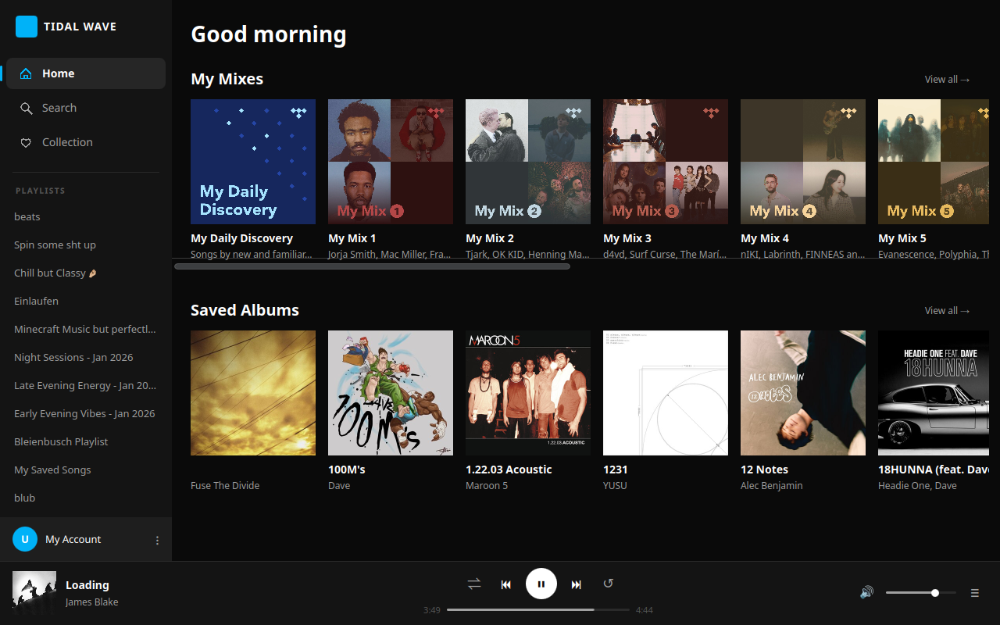
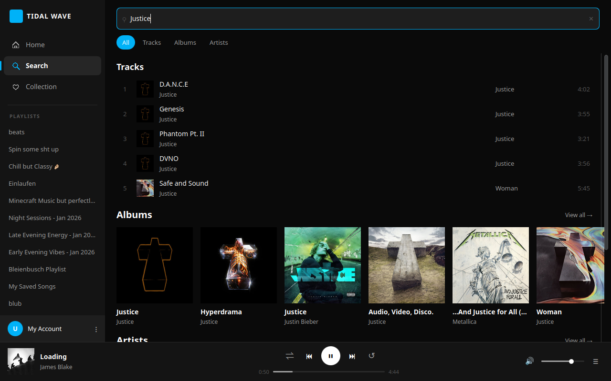
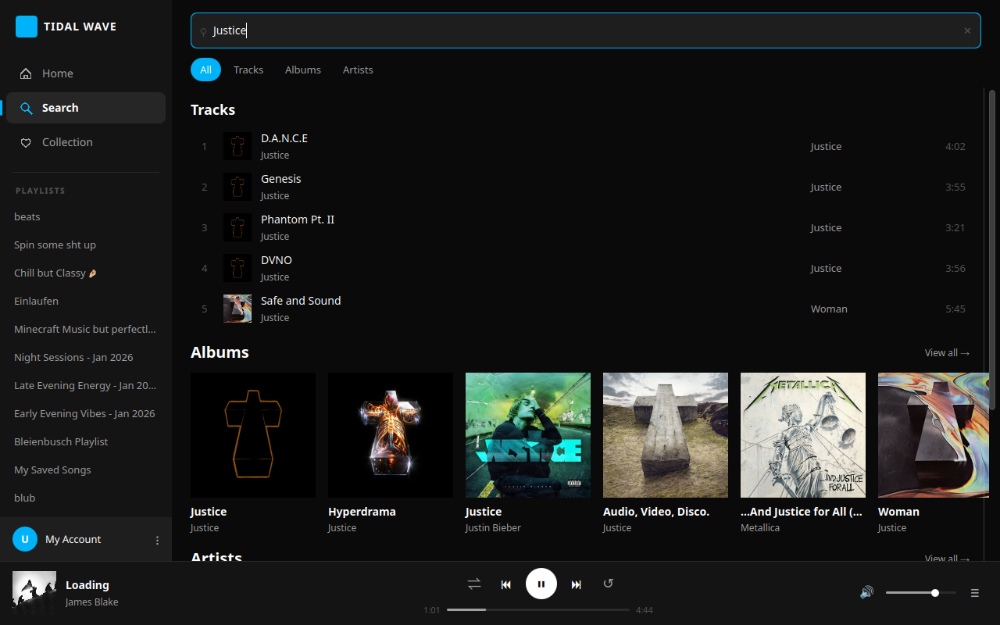
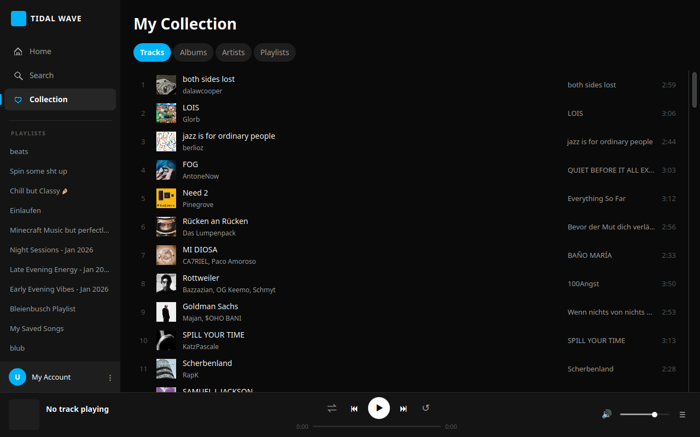
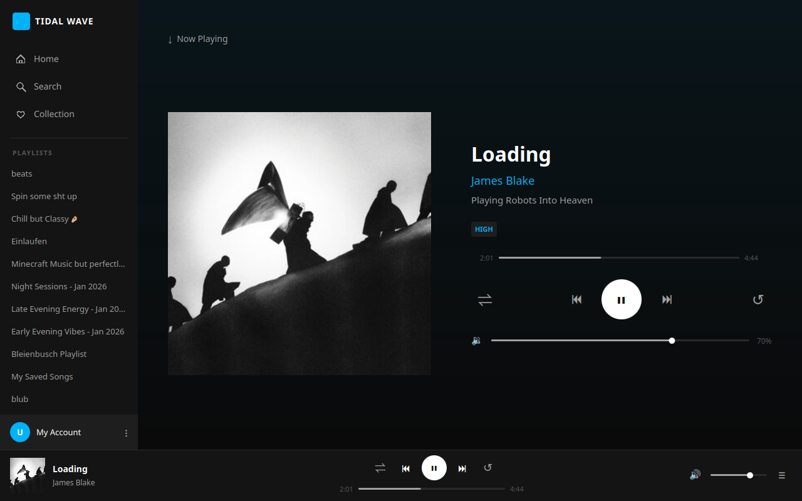

# 🌊 Tidal Wave Desktop Client

[](https://en.cppreference.com/w/cpp/20)
[](https://www.qt.io/)
[](LICENSE)
[](https://github.com/immineal/tidal-wave)

**Tidal Wave** is a desktop client for the **Tidal** music streaming service, built with C++20, CMake, and Qt 6/QML. 

> [!WARNING]
> **Project Status**: This project is currently in **Alpha / Active Development**. While the core streaming and API backend are functional, the user interface contains several visual, navigation, and input bugs that are documented below.

---

## 🎨 Visual Interface (Current State)

### Home Page


### Search & Album View
| Search Page | Album details |
| :---: | :---: |
|  |  |

### Collection & Playback
| Collection Page | Fullscreen Now Playing |
| :---: | :---: |
|  |  |

---

## 🔍 Codebase Verification & Feature Status

### Functional Features

*   **OAuth Authentication**: Fully implemented in `src/api/Auth.cpp`. Handles login request/response, secure token storage, and session recovery on startup.
*   **Audio Playback Backend**: Powered by `QMediaPlayer` and `QAudioOutput` (`src/player/Player.cpp`). Supports playing direct MP4 streams or generating/loading local MPD manifests (`/tmp/tidal-wave-XXXXXX.mpd`).
*   **Linux MPRIS2 Support**: Full system media integration (`src/mpris/`) publishing playback state, media keys mapping, and volume control to Linux desktop environments.
*   **Discord Rich Presence (RPC)**: Integrated via `src/ui/discordrpc.cpp`. Synchronizes status, active song, artist labels, cover art URL, and duration progress to Discord.
*   **Collection Syncing**: Supports fetching saved tracks, playlists, albums, and artists via `src/api/TidalClient.cpp`.

---

## ⚠️ Known Bugs & UX Regressions (Alpha Phase)

The following issues were identified in visual and interactive testing of the current UI:

1.  **Playback Control Bugs**:
    *   **Slider Drag Lock**: Neither the Volume slider nor the Seek bar responds to mouse dragging. The handle remains frozen when dragged, though clicking directly on the track snaps to the position.
    *   **Repeat Button States**: The "repeat all" state is visually identical to "off" (uses the same grey icon with no color change). Only "repeat one" is distinguishable (via a tiny badge).
    *   **Mute Icon**: The volume control rendering uses a colorful emoji glyph (`🔇`/`🔊`) rather than a themed vector path.
2.  **Visual and Text Rendering**:
    *   **Chromatic Aberration**: Vector icons show colored fringing/ghosting along edges due to sub-pixel positioning offsets or rendering scaling mismatches.
    *   **Unicode Blanking**: Album titles with special symbols (e.g. `∄`) fail to render and draw blank headers if the system font lacks the glyph.
3.  **UI & Navigation Regressions**:
    *   **Scroll Interception**: Mouse-wheel scrolling is completely blocked on the Search Page results layout.
    *   **Dead Links**: Artist and Album links on the Now Playing page do not navigate when clicked.
    *   **View All Links**: "View All" links on the Home page sections route to the generic Track Collection tab, rather than their specific sub-sections.
    *   **Sidebar Overlaps**: Clicking the account menu popup draws directly over the bottom username section, clipping the text.
4.  **Row and Hit-Box Interactivity**:
    *   **Hit-Box Size**: Click hit-boxes on Collection tab buttons are limited to the exact label pill bounds, making clicking frustrating.
    *   **Row Hover**: Hover states on track rows only detect mouse movement on the left half of the row; hovering over the right half fails to trigger the hover state.
    *   **Right-Click Menu**: Right-clicking a track row does not trigger the action context menu (only clicking the `⋯` icon works).

---

## 🛠️ Build & Installation

### Prerequisites
*   A compiler supporting C++20
*   CMake 3.20+
*   **Qt 6 SDK (6.4+)** with the following modules:
    *   `Core`, `Gui`, `Widgets`, `Quick`, `Qml`, `Network`, `DBus`, `Multimedia`, `Sql`, `Svg`, `Concurrent`

```bash
# Ubuntu / Debian
sudo apt install build-essential cmake qt6-base-dev qt6-declarative-dev qt6-multimedia-dev qt6-svg-dev libqt6svg6-dev libsqlite3-dev
```

### Build Steps
```bash
cmake -B build -S . -DCMAKE_BUILD_TYPE=Release
cmake --build build --parallel $(nproc)
./build/tidal-wave
```

---

## 📝 License

This project is licensed under the MIT License. See the [LICENSE](LICENSE) file for details.
