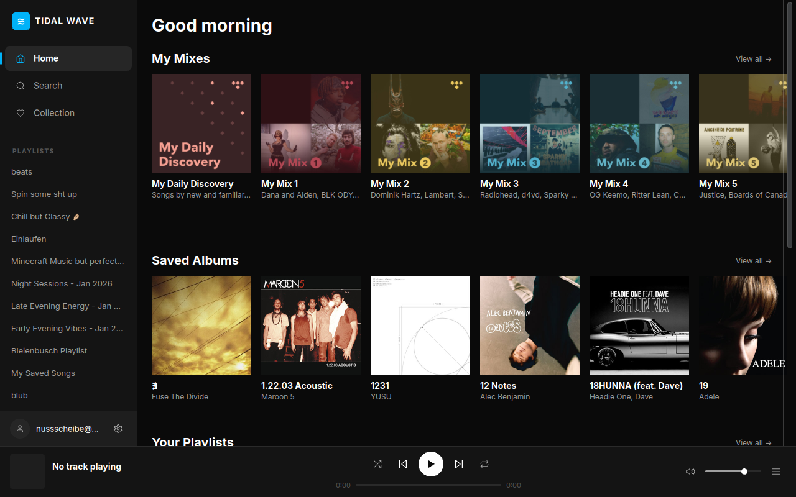

Tidal Wave is not affiliated with TIDAL Music AS.

# Tidal Wave Desktop Client

Tidal Wave is a native, lightweight desktop client for the Tidal music streaming service. It is built using C++20, CMake, and Qt 6/QML, delivering a fast, system-integrated music listening experience.

## Interface Screenshot



## Noteworthy Features

*   **Native Performance**: Built with C++20 and Qt 6, bypassing heavy web wrappers for a minimal CPU and memory footprint.
*   **Media Keys and MPRIS2**: Full Linux media player integration via D-Bus MPRIS2, supporting lockscreen controls, system volume widgets, and media keys.
*   **Secure Authentication**: Implements Tidal OAuth device login flow with secure local session caching using SQLite.
*   **Custom Audio Player**: Native streaming audio engine utilizing QMediaPlayer and QAudioOutput with selectable stream qualities.
*   **Chromecast Output** (Linux): Cast audio to Chromecast / Google Home devices — native mDNS discovery (Avahi) and CASTV2 control, with a built-in HTTP server that streams the current track (FLAC up to 96 kHz, or AAC) directly to the device. Downloads/downsamples on the fly so every quality tier casts.
*   **Persistent Navigation State**: Separate loaders retain individual page states when jumping between Home, Search, and My Collection views.
*   **Queue Panel**: Full queue management including track ordering, shuffle, and cycle repeat modes.
*   **System Tray Integration**: Background playback support with system tray control options to show, hide, and quit the application.
*   **Rich Detail Pages**: Dedicated views for albums, artists, playlists, and mixes. Biographies are parsed as rich text with clickable navigation links.
*   **Robust Sleep Timer**: Persistent background sleep timer in the Now Playing page with presets, a custom slider, a toggleable fade-out fader (with pop-prevention delay), and an end-of-track stopping mode.

## AI notice

I used Claude Code over the course of 3 days to generate most of the code for this project, since I recently won some Anthropic API credits and wanted to put them to use. I also don't currently have the time to do this any other way, even if I wanted to. It's a shame, since I'm generally really not a supporter of AI, but I wanted the performance increase and the money was already spent.

## Keyboard Shortcuts

| Shortcut | Action |
| --- | --- |
| Space | Play / Pause |
| Ctrl + Right | Next track |
| Ctrl + Left | Previous track |
| Right | Seek forward 10 seconds |
| Left | Seek backward 10 seconds |
| Up | Volume up (5% increment) |
| Down | Volume down (5% increment) |
| Ctrl + M | Mute / Unmute |
| Ctrl + S | Toggle Shuffle |
| Ctrl + R | Cycle Repeat Mode (Off / All / One) |
| Ctrl + 1 | Go to Home |
| Ctrl + 2 | Go to Search |
| Ctrl + 3 | Go to Collection |
| Ctrl + N | Fullscreen Now Playing view |
| Ctrl + Q | Toggle Queue panel |
| Escape | Go back |
| Alt + Left | Go back |
| Ctrl + , | Open Settings |

## Installation (Linux)

The easiest way to install on Debian/Ubuntu-based distros is the prebuilt **`.deb`** from the
[latest GitHub Release](https://github.com/immineal/tidal-wave/releases/latest). It declares all
runtime dependencies, so `apt` pulls in the Qt6 runtime, QML modules, and everything else for you —
no more hunting down packages by hand:

```bash
sudo apt install ./tidal-wave-linux-x86_64.deb
```

For downloads and Chromecast transcoding, also install `ffmpeg` (a `Recommends`, so most setups get
it automatically). To build from source instead, see below.

## Prerequisites

*   C++20-compliant compiler (GCC 11+, Clang 13+, MSVC 2022+)
*   CMake 3.20+
*   Qt 6 SDK (6.4+), specifically the following modules: Core, Gui, Widgets, Quick, Qml, QmlModels, Network, DBus, Multimedia, Sql, Svg, Concurrent
*   On Linux: libsqlite3-dev, libasound2-dev (or similar ALSA development libraries), and libavahi-client-dev (for Chromecast device discovery)

## Building from Source

```bash
cmake -B build -S . -DCMAKE_BUILD_TYPE=Release
cmake --build build --config Release --parallel 4
```

## Running the Application

On Linux and macOS:
```bash
./build/tidal-wave
```

On Windows:
```cmd
build\Release\tidal-wave.exe
```

## Building a Debian package (.deb)

The build ships a CPack configuration that produces a `.deb` with the correct runtime
dependencies declared (so users no longer have to hunt down packages by hand), plus a
desktop entry and hicolor icons:

```bash
cmake -B build -S . -DCMAKE_BUILD_TYPE=Release
cmake --build build --config Release --parallel 4
cd build && cpack -G DEB
sudo apt install ./tidal-wave-*-Linux.deb   # pulls in Qt6 runtime, QML modules, ffmpeg, etc.
```

`ffmpeg` is a `Recommends` (only needed for the download feature); everything else is a
hard `Depends`, including the easy-to-miss `qml6-module-*` runtime modules.

## License

This project is licensed under the GNU GPL v3 License. See the LICENSE file for details.
