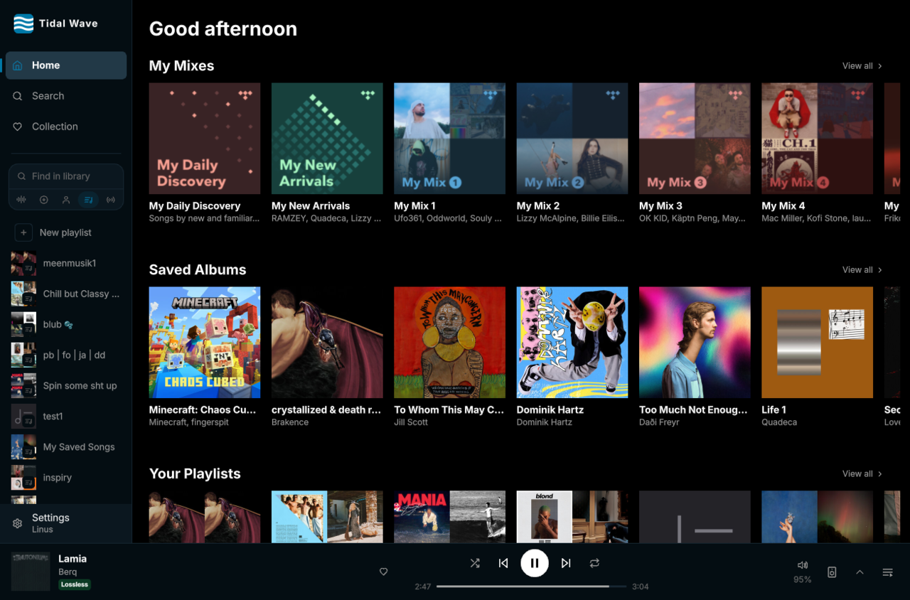
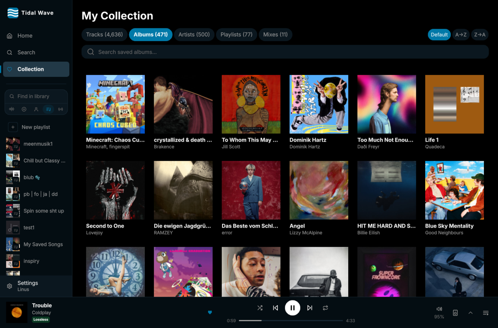
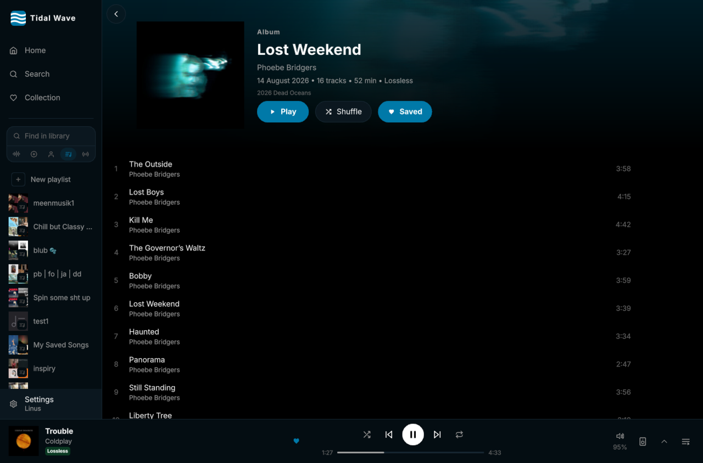
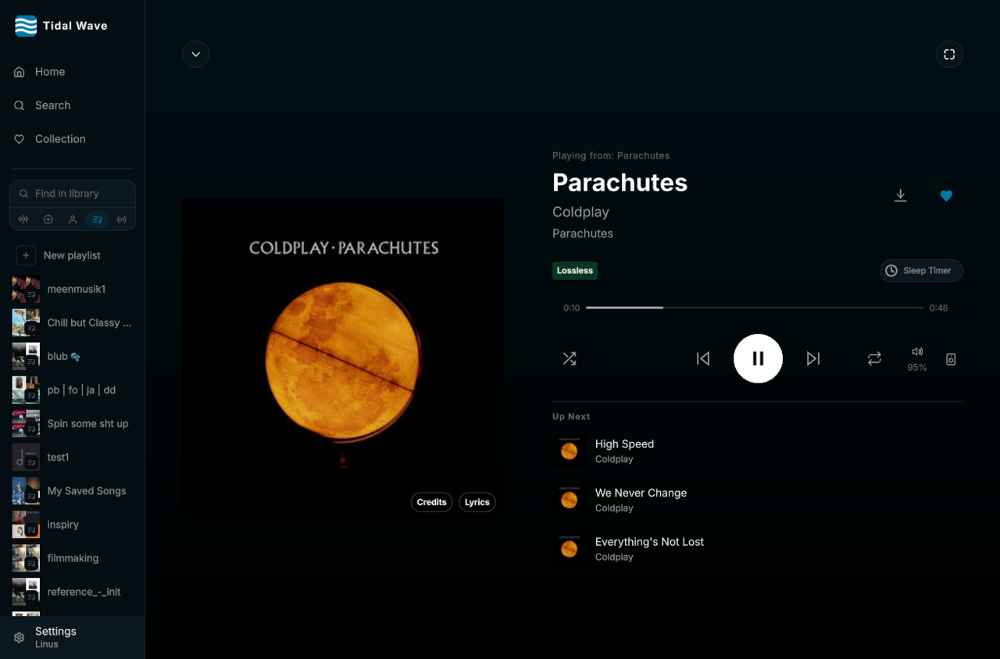
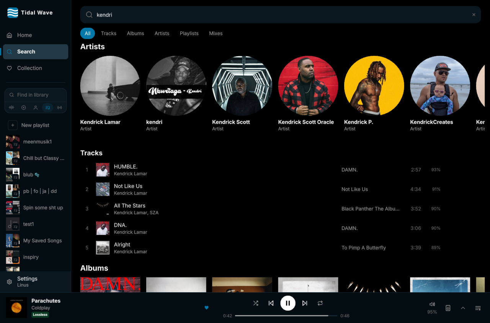

Tidal Wave is not affiliated with TIDAL Music AS.

# Tidal Wave

A desktop client for Tidal, written in C++ with Qt 6 and QML rather than wrapped
around a web view. It plays your collection, playlists and mixes, searches the
catalogue, follows album and artist pages, and keeps a queue you can reorder.

You need a Tidal account with an active subscription, and lossless playback
needs a plan that includes it.

It is built and used on Linux, specifically openSUSE with KDE Plasma on
Wayland; X11 works too. The macOS and Windows builds get far less attention, and
`docs/MACOS-FIRST-RUN.md` is the running list of what is known to be wrong on a
Mac. The goal is for this to be the easiest thing to install on whatever system
you happen to use.



Your collection, an album, the now playing view and search:

 
 

## Features

- Login uses Tidal's OAuth device flow. You type your password on Tidal's own
  site in your browser, and the app never sees it. The session is cached as
  plain JSON in `~/.config/tidal-wave/credentials.json`; see Privacy below.
- Four stream qualities: 96 kbps, 320 kbps, lossless, and hi-res lossless.
- Media keys, the lock screen and the desktop's player widget work through
  MPRIS2 on D-Bus.
- The audio output follows the system default device as it changes, or stays on
  a device you pick. Position and play state survive the switch
  (`src/player/Player.cpp`).
- Chromecast and Google Home output, on Linux only. A built-in HTTP server
  streams the current track to the device as FLAC up to 96 kHz or as AAC,
  downsampling on the fly so every quality tier casts.
- One flat sidebar list of your playlists, albums, artists and mixes, pinned
  first, then recently played, then A-Z, with a search field above it that also
  matches saved songs. Below 820px of window width it collapses to a 68px icon
  rail that hover-expands back over the content (`qml/components/SideBar.qml`,
  `qml/components/LibraryFinder.qml`).
- Pin albums, playlists, artists and mixes above that list and drag them into
  the order you want. Pins are kept per Tidal user id (`src/ui/PinStore.cpp`).
- Six themes, three dark (Sea, Pine, Rust) and three light (Sky, Sand, Clay),
  paired by hue, plus a true-black switch for OLED screens. Switching repaints
  the running app (`src/ui/ThemePalette.cpp`).
- A complete German catalogue, following your system locale by default and
  switchable without a restart (`src/ui/I18n.cpp`, `i18n/tidal-wave_de.ts`).
- The window goes down to 640x600, stacking the Now Playing transport and
  dropping the player bar's volume and cast controls on the way.
- A queue panel with drag-to-reorder, shuffle and the three repeat modes.
- A system tray icon, so playback carries on with the window closed.
- Album, artist, playlist and mix pages. Biographies are parsed as rich text
  with every name a link.
- A sleep timer on the Now Playing page, with presets, a custom slider, an
  optional fade-out and a mode that stops at the end of the track.
- The Qt scene graph can be moved onto the CPU for machines where the GPU path
  misbehaves. Qt picks the backend before the first window exists, so this needs
  a restart (`src/ui/Prefs.cpp`, `src/ui/Application.cpp`).
- A daily update check against the GitHub releases API, which you can turn off.
  See Privacy below.

## AI notice

I used Claude Code to generate most of the code for this project, since I recently won some Anthropic API credits and wanted to put them to use. I also don't currently have the time to do this any other way, even if I wanted to. It's a shame, since I'm generally really not a supporter of AI, but I wanted the performance increase and the money was already spent.

## Keyboard shortcuts

These are fixed; there is no rebinding UI yet. The table lives in
`src/ui/Shortcuts.cpp`.

| Shortcut | Action |
| --- | --- |
| Space | Play / pause |
| Ctrl + Right | Next track |
| Ctrl + Left | Previous track |
| Right | Seek forward 10 seconds |
| Left | Seek backward 10 seconds |
| Up | Volume up (5%) |
| Down | Volume down (5%) |
| Ctrl + M | Mute / unmute |
| Ctrl + S | Toggle shuffle |
| Ctrl + R | Cycle repeat mode (off / all / one) |
| Ctrl + 1 | Go to Home |
| Ctrl + 2 | Go to Search |
| Ctrl + 3 | Go to Collection |
| Ctrl + N | Go to Now Playing |
| F11 | Toggle fullscreen |
| Ctrl + J | Toggle the queue panel |
| Escape | Go back |
| Alt + Left | Go back |
| Ctrl + , | Open Settings |

On macOS Qt maps Ctrl onto Command, so Ctrl + M collides with Minimize and F11
with Mission Control. Both are left as they are, since Linux is where the app
ships.

## Installation

Prebuilt downloads for every platform are on the
[latest release](https://github.com/immineal/tidal-wave/releases/latest).
`ffmpeg` is optional, and only downloads and Chromecast need it.

<details open>
<summary><b>Linux, Debian / Ubuntu / Mint (recommended)</b></summary>

Download `tidal-wave-linux-x86_64.deb`, then:

```bash
sudo apt install ./tidal-wave-linux-x86_64.deb
```

`apt` pulls in the Qt 6 runtime and the QML modules. Launch it from your app
menu or run `tidal-wave`.

Every Qt dependency in the package carries a floor taken from the Qt it was
built against, so on an older distribution `apt` refuses the install and names
what is missing. That is better than installing something that dies at load with
`version 'Qt_6.12' not found`. If apt refuses, build from source below, which is
far more forgiving.
</details>

<details>
<summary><b>Linux, other distros (Fedora, Arch, …)</b></summary>

Download `tidal-wave-linux-x86_64.tar.gz`, extract it, and run the binary:

```bash
tar -xzf tidal-wave-linux-x86_64.tar.gz
./tidal-wave
```

Install the runtime yourself. This build links Qt 6 Core, Gui, Widgets, Quick,
Qml, QmlModels, Network, DBus, Multimedia, Svg, Concurrent and QuickControls2,
and wants `ffmpeg` and `avahi` for Chromecast. The QML modules are the ones
people miss: QtQuick, QtQuick.Shapes, QtQuick.Controls, QtQuick.Layouts,
QtQuick.Window, QtQuick.Templates, QtQml.Models and QtQml.WorkerScript. On
Wayland you also need the Qt 6 Wayland platform plugin. Building from source is
often easier on these distros.
</details>

<details>
<summary><b>macOS (Apple Silicon)</b></summary>

Download `tidal-wave-macos-x64.tar.gz` and unpack it. The `x64` in that filename
is a leftover; the release is built on GitHub's `macos-latest` runner, which is
Apple Silicon. On an Intel Mac, build from source.

The app is unsigned, so macOS quarantines it. Clear that once:

```bash
xattr -dr com.apple.quarantine tidal-wave.app
```

Then double-click `tidal-wave.app`, or right-click it and choose **Open** on the
first launch. For downloads, `brew install ffmpeg`.
</details>

<details>
<summary><b>Windows 10 / 11</b></summary>

Download `tidal-wave-windows-x64.zip`, extract the folder anywhere, and run
`tidal-wave.exe`. It's unsigned, so SmartScreen will warn you the first time:
click **More info**, then **Run anyway**. The Qt runtime and the QML are in the
folder. For downloads, install
[ffmpeg](https://www.gyan.dev/ffmpeg/builds/) and add it to your `PATH`.
</details>

## Build from source (any OS)

You need a C++20 compiler (GCC 11+ / Clang 13+ / MSVC 2022+), CMake 3.20+, and
Qt 6. `CMakeLists.txt` asks for Qt 6.4 as its floor, but the only two
configurations anyone builds are CI's Qt 6.12 and the bookworm container in
`packaging/`, which is 6.4.2. Treat anything in between as untested.

| OS | Command |
|----|---------|
| Debian/Ubuntu | `sudo apt install build-essential cmake pkg-config qt6-base-dev qt6-declarative-dev qt6-multimedia-dev qt6-svg-dev qt6-tools-dev qt6-tools-dev-tools libavahi-client-dev qml6-module-qtquick-controls qml6-module-qtquick-shapes ffmpeg` |
| Fedora | `sudo dnf install gcc-c++ cmake qt6-qtbase-devel qt6-qtdeclarative-devel qt6-qtmultimedia-devel qt6-qtsvg-devel qt6-qttools-devel avahi-devel ffmpeg` |
| Arch | `sudo pacman -S base-devel cmake ninja qt6-base qt6-declarative qt6-multimedia qt6-svg qt6-tools avahi ffmpeg` |
| macOS | `brew install cmake qt ffmpeg` |
| Windows | Install [Qt 6](https://www.qt.io/download-qt-installer) (MSVC 2022) + [CMake](https://cmake.org/download/) + Visual Studio 2022 Build Tools |

Do not skip the Qt Linguist tools in those lines. CMake treats them as optional,
so without them the configure step prints one warning and then builds a binary
with no German in it, which looks like a translation bug.

```bash
cmake -B build -S . -DCMAKE_BUILD_TYPE=Release   # macOS: add -DCMAKE_PREFIX_PATH=$(brew --prefix qt)
cmake --build build --config Release --parallel
./build/tidal-wave                                # Windows: build\Release\tidal-wave.exe ; macOS: open build/tidal-wave.app
```

The tests are behind an option that defaults to off:

```bash
cmake -B build -S . -DTIDALWAVE_BUILD_TESTS=ON -DCMAKE_BUILD_TYPE=Debug
cmake --build build && ctest --test-dir build --output-on-failure
```

For a Debian package, run `packaging/build-deb.sh`. It builds in a Debian 12
container and leaves the `.deb` in `dist/`. Plain `cpack -G DEB` in your build
directory works too, but the dependency floors come from whichever toolchain
configured the build, so a package built against Qt 6.12 and GCC 16 asks for
versions almost nobody has.

`ffmpeg` is the package's only `Recommends`. Everything else is a hard
`Depends`, including `qt6-wayland` and the easy-to-miss `qml6-module-*` runtime
modules. Downloads and Chromecast shell out to `ffmpeg` and say so when it is
missing, so the app still runs without it.

> Linker error about `lame_*` / `mp3lame`? A few distros ship a *statically*
> linked FFmpeg inside Qt Multimedia, which leaks an undeclared `libmp3lame`
> dependency at final link time. Install your distro's `libmp3lame`/`lame` dev
> package and configure with
> `-DCMAKE_EXE_LINKER_FLAGS="-lmp3lame -lm"`.

> Chromecast output is Linux-only, since it uses Avahi and mDNS. It is excluded
> automatically on macOS and Windows.

## Privacy

Tidal Wave has no account, no server and no telemetry. Everything below can be
checked against the source in a few minutes; the file that does each thing is
named.

### What leaves your machine

*   **Tidal, to log in.** `https://auth.tidal.com/v1/oauth2/...` (`src/api/Auth.cpp`).
    The device flow sends a client id and secret compiled into the app
    (`src/api/Auth.h`), then the device code, then your refresh token. You type your
    password on Tidal's own site in your browser, which the app opens with `xdg-open`.
*   **Tidal, for everything you do in the app.** `https://api.tidal.com/v1/...`
    (`src/api/TidalApi.cpp`, `src/api/TidalClient.cpp`). Every request carries your access
    token and your country code, so Tidal sees what you search for, which albums, artists,
    playlists and mixes you open, what you play, what you favourite, and the playlists you
    create or edit. That is the streaming service working, not something extra the client
    adds. One detail worth knowing: the app sends a desktop browser User-Agent string
    rather than its own name (`TidalApi::makeRequest`).
*   **Tidal, for audio and artwork.** Audio comes from the CDN URL in the playback manifest
    (`src/player/Player.cpp`, `src/player/Downloader.cpp`). Cover art comes from
    `https://resources.tidal.com/images/...` (`src/ui/ImageProvider.cpp`), and those
    requests carry no account token.
*   **Your local network, while you cast.** Discovery is mDNS: the app asks Avahi to browse
    for `_googlecast._tcp` on every interface (`src/cast/CastDiscovery.cpp`), which is
    multicast traffic your whole LAN can see. Picking a device opens a TLS connection and
    sends the track title, artist, album and a `resources.tidal.com` cover URL
    (`src/cast/CastSession.cpp`, `src/cast/CastManager.cpp`); Chromecasts use self-signed
    certificates, so the app does not verify them. To feed the device it starts a small
    HTTP server on your LAN address on a random port (`src/cast/CastMediaServer.cpp`).
    That server is unauthenticated, so while a track is casting, anything on your network
    that connects to the port is served that track. It stops when casting stops, and none
    of it runs unless you open the cast menu.
*   **GitHub, for the update check.** One `GET` to
    `https://api.github.com/repos/immineal/tidal-wave/releases/latest`, at most once every
    24 hours (`src/ui/UpdateCheck.cpp`). It sends no account data and no identifier, but it
    does send a `User-Agent` of `tidal-wave/<version>
    (+https://github.com/immineal/tidal-wave)`, so GitHub sees your IP address and which
    version you run. The reply is a version number and a link.
*   **Nothing, for feedback.** The two buttons in Settings -> Feedback open a URL and stop
    there. "Open a GitHub issue" builds
    `https://github.com/immineal/tidal-wave/issues/new?title=...&body=...`, "Send an email"
    builds `mailto:tidal-wave@linu.li?subject=...` (`src/ui/Feedback.cpp`), and both go to
    `Application::openUrl`, which is `xdg-open`. Your browser or your mail client does the
    talking, and only when you press send there. The issue body is prefilled with the app
    version, `QSysInfo::prettyProductName()` and the Qt the build was compiled against and
    is running on, and nothing about your account or what you have played.
    `tidal-wave@linu.li` is a mailbox kept for this; the app never signs in to it and
    carries no credential for it.

### What is stored on your machine

*   **`~/.config/tidal-wave/credentials.json`** holds your access and refresh tokens, the
    token expiry, your Tidal user id, your country code and your display name
    (`Auth::saveCredentials`). It is plain JSON, readable and writable by your user only,
    not encrypted and not in a system keyring, so anything running as you can read it, and
    the refresh token is enough to use your account. Logging out deletes it. Note the
    lowercase directory name: this is not the same place as the settings below.
*   **`~/.config/TidalWave/Tidal Wave.conf`** is the `QSettings` file. It holds the theme,
    language, sidebar width, audio output device and software rendering flag
    (`src/ui/Prefs.cpp`), the preferred stream quality (`src/api/TidalBridge.cpp`), the last
    download folder (`src/player/Downloader.cpp`), your pinned items and recently played
    list keyed by Tidal user id (`src/ui/PinStore.cpp`, `src/player/Player.cpp`), and the
    update check's state (`src/ui/UpdateCheck.cpp`).
*   **`~/.local/share/TidalWave/Tidal Wave/`** (`QStandardPaths::AppDataLocation`) holds
    `library/albumtracks-<userId>.json`, a cache of your library's album track listings so
    that searching your collection does not re-fetch it (`src/api/LibraryIndex.cpp`).
*   **`~/.local/share/icons/hicolor/scalable/apps/tidal-wave.svg`** and
    **`128x128/apps/tidal-wave.png`** are the app icon, installed by `cmake --install` so
    the tray, taskbar and launcher can resolve it by name. The app writes a copy itself only
    when the icon theme has none, which happens when it runs from a build tree
    (`Application::loadAppIcon`). `docs/ICONS.md` maps every surface the icon appears on.
*   **Downloads** go wherever you choose in the save dialog, defaulting to your Music
    folder. **Cast transcodes** are temporary files named `tidal-wave-cast-*` in your temp
    directory, each deleted when the next track is prepared and when the app shuts down
    (`CastMediaPrep::cancel`). A crash leaves the last one behind.
*   On Linux the current track is published on your session bus over MPRIS2, which is how
    media keys and the desktop's media widget work. Any program running as you can read it.

Deleting those paths removes everything the app has kept about you.

### The update check

It is cached to disk, so most launches make no request at all. A newer release is offered
at the *next* launch rather than in the middle of a session, with Open release, Later and
Skip this version. Tidal Wave never downloads, installs or applies an update by itself.

To turn it off, set `update/enabled` to `false` in the settings file above, which you can
do before the first launch. With it off, `UpdateCheck::startupCheck()` and `checkNow()`
return immediately and no `QNetworkAccessManager` is ever created.

## License

GNU General Public License, version 3 or later (`GPL-3.0-or-later`). The full
text of GPLv3 is in `LICENSE`.
