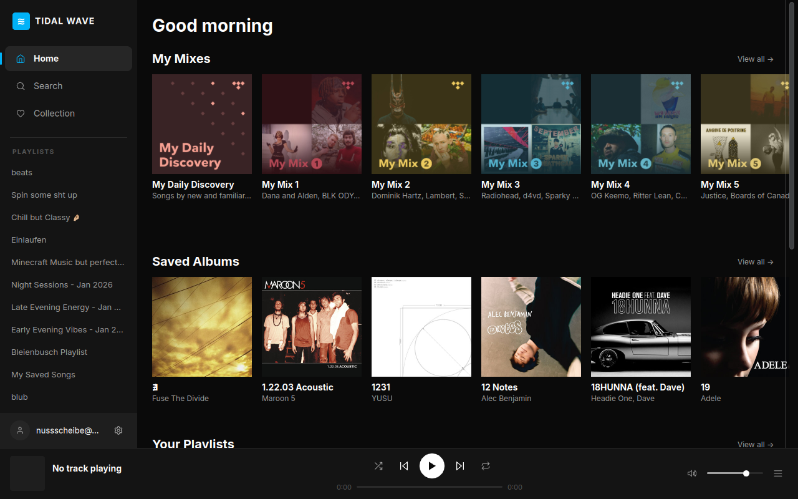

Tidal Wave is not affiliated with TIDAL Music AS.

# Tidal Wave Desktop Client

Tidal Wave is a native, lightweight desktop client for the Tidal music streaming service. It is built using C++20, CMake, and Qt 6/QML, delivering a fast, system-integrated music listening experience.

## Interface Screenshot



## Noteworthy Features

*   **Native Performance**: Built with C++20 and Qt 6, bypassing heavy web wrappers for a minimal CPU and memory footprint.
*   **Media Keys and MPRIS2**: Full Linux media player integration via D-Bus MPRIS2, supporting lockscreen controls, system volume widgets, and media keys.
*   **Authentication**: Tidal OAuth device login flow. You enter your password on Tidal's own site in your browser, never in this app. The session is cached locally as a plain JSON file, `~/.config/tidal-wave/credentials.json` (`src/api/Auth.cpp`). It is written readable and writable by your user only, and it is not encrypted and not kept in a system keyring. The Privacy section below says exactly what is in it.
*   **Custom Audio Player**: Native streaming audio engine utilizing QMediaPlayer and QAudioOutput with selectable stream qualities.
*   **Live Audio Output Switching**: The player follows the system default output device as it changes, or stays on a device you pick. Playback position and play state survive the switch (`src/player/Player.cpp`).
*   **Chromecast Output** (Linux): Cast audio to Chromecast / Google Home devices. Native mDNS discovery (Avahi) and CASTV2 control, with a built-in HTTP server that streams the current track (FLAC up to 96 kHz, or AAC) directly to the device. Downloads/downsamples on the fly so every quality tier casts.
*   **Library Sidebar**: One flat list of your playlists, albums, artists and mixes, ordered pinned first, then recently played, then A-Z. A search field above it also matches saved songs, with type filter chips next to it. Below 820px of window width the sidebar collapses to a 68px icon rail that hover-expands back over the content; its border is a drag handle (`qml/components/SideBar.qml`, `qml/components/LibraryFinder.qml`).
*   **Pinning**: Pin albums, playlists, artists and mixes to a block above the library list, reorder them by dragging. Stored per Tidal user id (`src/ui/PinStore.cpp`).
*   **Six Themes**: Four dark (Midnight, Forest, Ember, Deep) and two light (Daylight, Paper). Switching repaints the running app (`src/ui/ThemePalette.cpp`).
*   **German Translation**: A complete German catalogue. The language follows your system locale by default and can be switched without restarting (`src/ui/I18n.cpp`, `i18n/tidal-wave_de.ts`).
*   **Responsive Down to 640px**: The window minimum is 640x600. Narrow windows stack the Now Playing transport, drop the player bar's volume and cast controls, and trim the track list's columns.
*   **Persistent Navigation State**: Separate loaders retain individual page states when jumping between Home, Search, and My Collection views.
*   **Queue Panel**: Full queue management including track ordering, shuffle, and cycle repeat modes.
*   **System Tray Integration**: Background playback support with system tray control options to show, hide, and quit the application.
*   **Rich Detail Pages**: Dedicated views for albums, artists, playlists, and mixes. Biographies are parsed as rich text with clickable navigation links.
*   **Sleep Timer**: Persistent background sleep timer in the Now Playing page with presets, a custom slider, a toggleable fade-out fader (with pop-prevention delay), and an end-of-track stopping mode.
*   **Software Rendering**: The Qt scene graph can be put on the CPU for machines where the GPU path misbehaves or costs power while the app idles. It also drops the 4x multisampling. Qt picks the backend before the first window exists, so the choice is read at startup and changing it needs a restart. Stored as `ui/softwareRendering` (`src/ui/Prefs.cpp`, `src/ui/Application.cpp`).
*   **Update Check**: At most one request a day to the GitHub releases API, offered at the next launch rather than mid-session. The app never downloads or installs anything itself. It can be turned off. See Privacy below.

## AI notice

I used Claude Code over the course of 3 days to generate most of the code for this project, since I recently won some Anthropic API credits and wanted to put them to use. I also don't currently have the time to do this any other way, even if I wanted to. It's a shame, since I'm generally really not a supporter of AI, but I wanted the performance increase and the money was already spent.

## Keyboard Shortcuts

| Shortcut | Action |
| --- | --- |
| Space | Play / Pause |
| Ctrl + Right | Next track |
| Ctrl + Left | Previous track |
| Right | Seek forward 10 seconds |
| Left | Seek backward 10 seconds |
| Up | Volume up (5% increment) |
| Down | Volume down (5% increment) |
| Ctrl + M | Mute / Unmute |
| Ctrl + S | Toggle Shuffle |
| Ctrl + R | Cycle Repeat Mode (Off / All / One) |
| Ctrl + 1 | Go to Home |
| Ctrl + 2 | Go to Search |
| Ctrl + 3 | Go to Collection |
| Ctrl + N | Fullscreen Now Playing view |
| Ctrl + Q | Toggle Queue panel |
| Escape | Go back |
| Alt + Left | Go back |
| Ctrl + , | Open Settings |

## Installation

Prebuilt downloads for every platform are on the **[latest release](https://github.com/immineal/tidal-wave/releases/latest)**.
Pick your system below. (`ffmpeg` is optional but needed for the download and Chromecast features.)

<details open>
<summary><b>🐧 Linux, Debian / Ubuntu / Mint (recommended)</b></summary>

Download **`tidal-wave-linux-x86_64.deb`**, then:

```bash
sudo apt install ./tidal-wave-linux-x86_64.deb
```

That's it. `apt` pulls in the Qt 6 runtime, the QML modules and everything else automatically,
so there is nothing to chase. Launch it from your app menu or run `tidal-wave`.
</details>

<details>
<summary><b>🐧 Linux, other distros (Fedora, Arch, …)</b></summary>

Download **`tidal-wave-linux-x86_64.tar.gz`**, extract it, and run the binary:

```bash
tar -xzf tidal-wave-linux-x86_64.tar.gz
./tidal-wave
```

Install the runtime yourself via your package manager: the Qt 6 libraries this build links
(Core, Gui, Widgets, Quick, Qml, QmlModels, Network, DBus, Multimedia, Sql, Svg, Concurrent,
the list in `CMakeLists.txt`) and their QML modules, plus `ffmpeg` and `avahi` for Chromecast.
The QML modules are the ones people miss: QtQuick, QtQuick.Shapes, QtQuick.Controls,
QtQuick.Layouts, QtQuick.Window, QtQuick.Templates and QtQml.WorkerScript. On Wayland you also
need the Qt 6 Wayland platform plugin. If it complains about a missing library, install the
matching Qt 6 runtime package. Building from source (below) is often easier on these distros.
</details>

<details>
<summary><b>🍎 macOS (Apple Silicon & Intel)</b></summary>

Download **`tidal-wave-macos-x64.tar.gz`** and unpack it (double-click, or `tar -xzf …`).
The app is unsigned, so macOS quarantines it. Clear that once:

```bash
xattr -dr com.apple.quarantine tidal-wave.app
```

Then double-click **`tidal-wave.app`**. (Alternatively: right-click the app → **Open** →
**Open** on the first launch.) For downloads, `brew install ffmpeg`.
</details>

<details>
<summary><b>🪟 Windows 10 / 11</b></summary>

Download **`tidal-wave-windows-x64.zip`**, extract the folder anywhere, and run **`tidal-wave.exe`**.
It's unsigned, so Windows SmartScreen will warn you the first time. Click **More info → Run anyway**.
Everything (Qt runtime, QML) is bundled in the folder. For downloads, install
[ffmpeg](https://www.gyan.dev/ffmpeg/builds/) and add it to your `PATH`.
</details>

## Build from source (any OS)

You need a C++20 compiler (GCC 11+ / Clang 13+ / MSVC 2022+), **CMake 3.20+**, and **Qt 6**.
`CMakeLists.txt` asks for Qt 6.4 as its floor and guards the newer Qt policies by version, but
the only configurations anyone builds are CI's, which is Qt 6.12. Treat anything older than
6.12 as untested rather than supported.

**Install the toolchain:**

| OS | Command |
|----|---------|
| Debian/Ubuntu | `sudo apt install build-essential cmake qt6-base-dev qt6-declarative-dev qt6-multimedia-dev libqt6svg6-dev qml6-module-qtquick-controls qml6-module-qtquick-shapes libasound2-dev libavahi-client-dev ffmpeg` |
| Fedora | `sudo dnf install gcc-c++ cmake qt6-qtbase-devel qt6-qtdeclarative-devel qt6-qtmultimedia-devel qt6-qtsvg-devel alsa-lib-devel avahi-devel ffmpeg` |
| Arch | `sudo pacman -S base-devel cmake qt6-base qt6-declarative qt6-multimedia qt6-svg avahi ffmpeg` |
| macOS | `brew install cmake qt ffmpeg` |
| Windows | Install [Qt 6](https://www.qt.io/download-qt-installer) (MSVC 2022) + [CMake](https://cmake.org/download/) + Visual Studio 2022 Build Tools |

**Build & run:**

```bash
cmake -B build -S . -DCMAKE_BUILD_TYPE=Release   # macOS: add -DCMAKE_PREFIX_PATH=$(brew --prefix qt)
cmake --build build --config Release --parallel
./build/tidal-wave                                # Windows: build\Release\tidal-wave.exe ; macOS: open build/tidal-wave.app
```

**Make a Debian package** (produces a `.deb` with all dependencies declared):

```bash
cd build && cpack -G DEB && sudo apt install ./tidal-wave-*-Linux.deb
```

> **Linker error about `lame_*` / `mp3lame`?** A few distros ship a *statically*
> linked FFmpeg inside Qt Multimedia, which leaks an undeclared `libmp3lame`
> dependency at final link time. If the build fails with undefined references to
> `lame_*`, install your distro's `libmp3lame`/`lame` dev package and configure with:
>
> ```bash
> cmake -B build -S . -DCMAKE_BUILD_TYPE=Release -DCMAKE_EXE_LINKER_FLAGS="-lmp3lame -lm"
> ```

> Chromecast output is Linux-only (it uses Avahi/mDNS); it's automatically excluded on macOS and Windows.

`ffmpeg` and `qt6-wayland` are `Recommends`; everything else is a hard `Depends`, including
the easy-to-miss `qml6-module-*` runtime modules. Downloads and Chromecast both shell out to
`ffmpeg` and say so when it is missing, so the app still runs without it.

## Privacy

Tidal Wave has no account, no server and no telemetry. There is no analytics, no crash
reporting and no usage tracking of any kind. Everything below can be checked against the
source in a few minutes; the file that does each thing is named.

### What leaves your machine

*   **Tidal, to log in.** `https://auth.tidal.com/v1/oauth2/...` (`src/api/Auth.cpp`,
    `src/api/TidalApi.cpp`). The device login flow sends a client id and client secret that
    are compiled into the app (`src/api/Auth.h`), then the device code, then your refresh
    token. You never type your password into Tidal Wave. You enter it on Tidal's own site
    in your browser, which the app opens with `xdg-open`.
*   **Tidal, for everything you do in the app.** `https://api.tidal.com/v1/...`
    (`src/api/TidalApi.cpp`, `src/api/TidalClient.cpp`). Every request carries your access
    token and your account's country code. Tidal therefore sees what you search for, which
    albums, artists, playlists and mixes you open, what you play, what you favourite, and
    the playlists you create or edit. That is the streaming service working, not something
    extra the client adds. One detail worth knowing: the app sends a desktop browser
    User-Agent string rather than its own name (`TidalApi::makeRequest`).
*   **Tidal, for audio and artwork.** Audio is fetched from the CDN URL that Tidal returns
    in the playback manifest (`src/player/Player.cpp`, `src/player/Downloader.cpp`). Cover
    art comes from `https://resources.tidal.com/images/...` (`src/ui/ImageProvider.cpp`).
    The artwork requests carry no account token.
*   **Your local network, only while you use Chromecast.** Discovery is mDNS: the app asks
    Avahi to browse for `_googlecast._tcp` on every interface (`src/cast/CastDiscovery.cpp`),
    which is multicast traffic visible to your whole LAN. When you pick a device, the app
    opens a TLS connection to it and sends the track title, artist, album and a
    `resources.tidal.com` cover URL (`src/cast/CastSession.cpp`, `src/cast/CastManager.cpp`).
    Chromecast devices use self-signed certificates, so the app does not verify the
    certificate. To feed the device, the app starts a small HTTP server bound to your
    machine's LAN address on a random port (`src/cast/CastMediaServer.cpp`). It is plain
    HTTP and it is not authenticated: while a track is casting, anything on your local
    network that connects to that port is served that track. The server stops when casting
    stops. None of this runs unless you open the cast menu.
*   **GitHub, for the update check.** One `GET` to
    `https://api.github.com/repos/immineal/tidal-wave/releases/latest`, at most once every
    24 hours (`src/ui/UpdateCheck.cpp`). It sends no account data and no identifier. It
    sends a `User-Agent` of `tidal-wave/<version> (+https://github.com/immineal/tidal-wave)`,
    so GitHub sees your IP address and which version you are running. The reply is a
    version number and a link.

### What is stored on your machine

*   **`~/.config/tidal-wave/credentials.json`** holds your Tidal OAuth access token and
    refresh token, the token expiry, your Tidal user id, your country code and your display
    name (`Auth::saveCredentials`). It is plain JSON. It is written readable and writable by
    your user only, and it is not encrypted and not kept in a system keyring. Anything
    running as you can read it, and the refresh token in it is enough to use your Tidal
    account. Logging out deletes the file. Note the lowercase directory name: this is not
    the same place as the settings below.
*   **`~/.config/TidalWave/Tidal Wave.conf`** is the `QSettings` file (organisation
    `TidalWave`, application `Tidal Wave`). It holds the theme, language, sidebar width,
    audio output device and software rendering flag (`src/ui/Prefs.cpp`), the preferred
    stream quality (`src/api/TidalBridge.cpp`), the last download folder
    (`src/player/Downloader.cpp`), and, keyed by your Tidal user id, your pinned items
    (`src/ui/PinStore.cpp`) and your recently played list (`src/player/Player.cpp`). It also
    holds the update check's state: whether it is on, when it last ran, the newest version
    it saw and any version you skipped (`src/ui/UpdateCheck.cpp`).
*   **`QStandardPaths::AppDataLocation`**, which on Linux is
    `~/.local/share/TidalWave/Tidal Wave/`, holds `library/albumtracks-<userId>.json`: a
    cache of your library's album track listings, so searching your collection does not
    re-fetch it (`src/api/LibraryIndex.cpp`).
*   **`~/.local/share/icons/hicolor/*/apps/tidal-wave.png`** is the app icon, exported on
    first launch so the tray and taskbar can resolve it by name (`Application::loadAppIcon`).
*   **Downloads** go wherever you choose in the save dialog, defaulting to your Music
    folder. **Cast transcodes** are temporary files named `tidal-wave-cast-*` in your temp
    directory. Each one is deleted when the next track is prepared and when the app shuts
    down (`CastMediaPrep::cancel`). A crash leaves the last one behind.
*   On Linux the current track is published on your session bus over MPRIS2, which is how
    media keys and the desktop's media widget work. Any program running as you can read it.

Deleting those paths removes everything the app has kept about you.

### The update check

It runs at most once a day, at startup, and it is cached to disk so most launches make no
request at all. If there is a newer release it is offered at the *next* launch, never in the
middle of a session, with Open release, Later and Skip this version. Open release opens the
GitHub page in your browser.

**Tidal Wave never downloads, installs or applies an update by itself.** There is no
updater, no background download and no self-replacing binary. Updating is something you do
with your package manager or by downloading the release yourself.

To turn it off, set `update/enabled` to `false` in the settings file above. You can do that
before the first launch. With it off, `UpdateCheck::startupCheck()` and `checkNow()` return
immediately and no `QNetworkAccessManager` is ever created, so nothing is sent to GitHub at
all.

## License

This project is licensed under the GNU GPL v3 License. See the LICENSE file for details.
